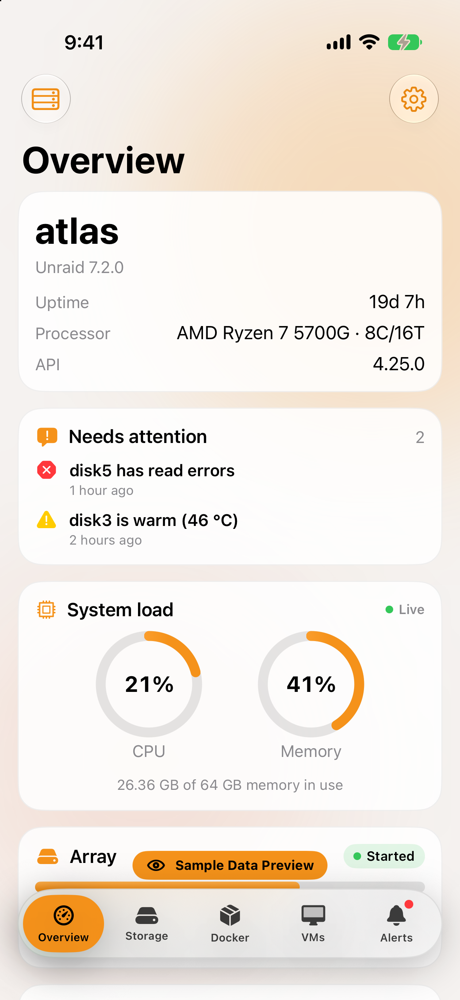
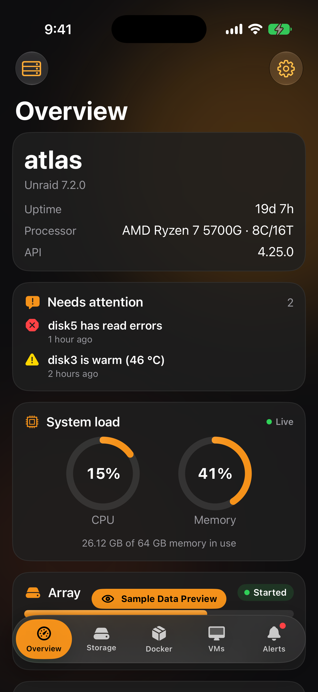
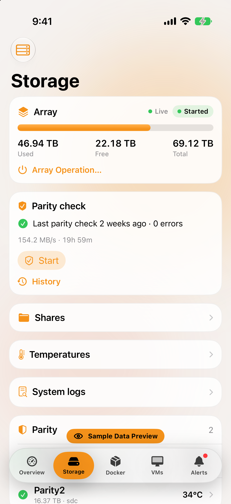
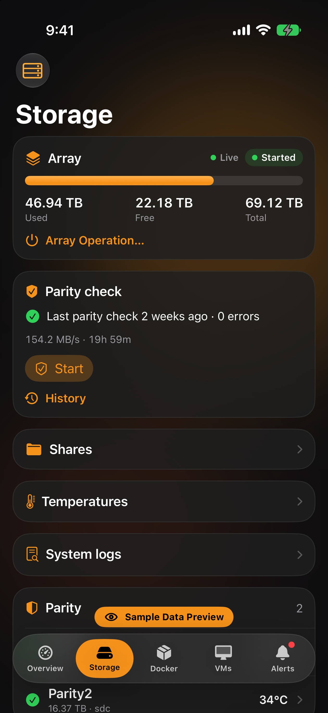
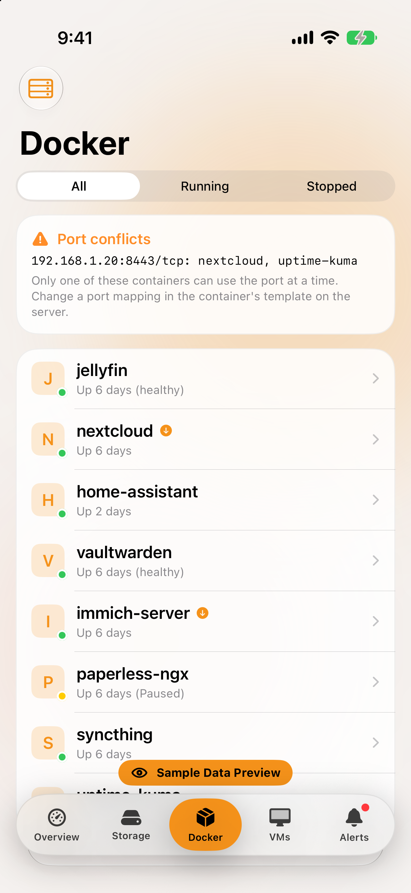
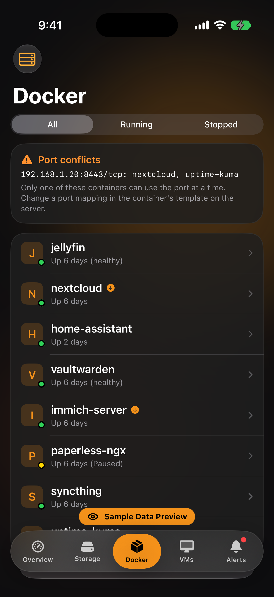
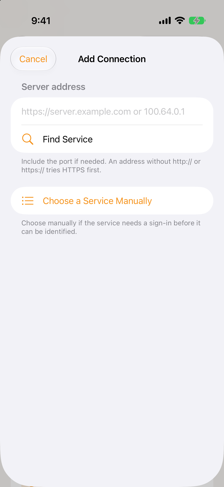

# Petty: Homelab

A homelab dashboard for iPhone, iPad, and Apple-silicon Macs. Monitor Unraid and the services around it, inspect what needs attention, and carry out routine maintenance from one place.

The app connects directly to the servers and services you add. Credentials are stored in this device's Keychain.

## Screenshots

These iPhone Air screenshots use the app's labelled sample data. They contain no live server information.

| Screen | Light | Dark |
|---|---|---|
| Overview |  |  |
| Storage |  |  |
| Docker |  |  |

### Connection setup



## What it does

- Monitor Unraid health, array, drives, Docker containers, virtual machines, and notifications.
- Connect media, download, automation, network, and infrastructure services. The full list and each integration's actions are below.
- Find many services by address, then use the sign-in form for the detected service. Services that cannot be identified before sign-in can be chosen manually.
- Set up service checks and local alerts, and use the SSH terminal for hosts you add.

## Verification status

- **Live connections:** Unraid, qBittorrent, Sonarr, Radarr, Lidarr, Prowlarr, Plex, Jellyfin, Emby, Audiobookshelf, and Komga have been connected to running services in the iPhone Air simulator. This verifies sign-in and the screens exercised during those sessions, not every action in the capability table.
- **Protocol-tested:** The local fixtures in `Scripts/` exercise documented authentication, handshakes and response shapes for the broader integration set.
- **Sample mode:** Every integration and the Unraid dashboard have labelled sample data. Samples never touch the network or mix with live data.

## Capability matrix

| Integration | API used | Read | Actions (see **Confirmations** below the table) | Protocol-tested |
|---|---|---|---|---|
| **Unraid** 7.2+ (or Unraid Connect plugin) | GraphQL `/graphql` + `graphql-transport-ws` subscriptions, `x-api-key` | Identity, live CPU/memory, array/parity/devices, drive health (overall SMART only) with error and temperature history recorded on the device, usage alert thresholds, shares, UPS, containers (+logs, update status, and on API 4.29+ template, orphan/rebuild state, LAN addresses, layer and log sizes, autostart position, support links, port conflicts), temperature sensors with the server's recent history (API 4.32+), read-only system log files, VMs, notifications | Container start/stop/restart/pause/resume/update; VM power incl. typed-name force stop/reset; parity check start/pause/resume/cancel; array start/stop (typed name, blockers); archive notifications | Subscription transport yes; client against GraphQL fixtures incl. an older-API server; every document validated against the published 4.37.5 schema |
| **Proxmox VE** | `api2/json`, `PVEAPIToken` | Nodes, guests (QEMU/LXC), recent tasks; per node `status` (CPU model, load, memory, root filesystem, kernel, Proxmox version, UEFI/Secure Boot), `storage` (usage, unavailable enabled stores) and `disks/list` health, with SMART attributes or the NVMe report from `disks/smart` (Sys.Audit); a failed task's log (`tasks/{upid}/log`) | Start, shutdown, reboot, suspend/resume (VM), stop and reset (typed name); the action's task is polled to completion | Yes |
| **TrueNAS SCALE** 25.04+ | JSON-RPC 2.0 over `wss://…/api/current`, `auth.login_with_api_key` | System, pools (+scrub progress), disks, alerts, datasets, jobs; periodic snapshot tasks and replication tasks with their last state and error (`pool.snapshottask.query`, `replication.query`; each shown only when the key's role can read it) | Scrub start/pause/stop; alert dismiss/restore (not confirmed; reversible); run one periodic snapshot task now (`pool.snapshottask.run`, confirmation explains that its retention then applies). HTTPS is required because TrueNAS revokes keys sent over HTTP | Yes, over pinned self-signed TLS |
| **Portainer** | `/api` + documented `/endpoints/{id}/docker` proxy, `X-API-Key` | Environments, containers (+stack label), stacks, container logs (multiplexed stream decoded); container health checks, failing streak, restart count and policy, out-of-memory kills and last exit from Docker's inspect endpoint (environment variables are never decoded) | Container start/stop/restart; stack start/stop | Yes |
| **Pi-hole** v6 | `/api`, session per request batch (always released) | Queries, blocked %, cache, clients, blocklist size, blocking state/timer; domain check (`/search/{domain}`: which allow/deny entry or blocklist decides it); the latest 50 queries (`/queries`, Owner profiles only); diagnosis messages (`/info/messages`) | Pause blocking for 5 min/30 min/1 h/indefinitely; resume (not confirmed); update blocklists (`/action/gravity`, confirmed); restart the resolver (`/action/restartdns`, destructive confirmation); allow one exact domain (`/domains/allow/exact`, confirmed) | Yes |
| **AdGuard Home** | `/control`, basic auth | Queries, blocked (filtering + safe browsing + parental), avg processing time, protection state; host check (`/filtering/check_host`: rule and list, blocked service, rewrite); the latest 50 queries (`/querylog`, Owner profiles only) | Pause protection (duration in ms, per spec); resume; refresh filter lists (`/filtering/refresh`, confirmed) | Yes |
| **UniFi Network** (official Integration API, 10.x) | `/proxy/network/integration/v1`, `X-API-KEY` | Sites, devices (state, firmware update availability), clients (paginated); per device: ports with link speed and PoE state, radios with channel and width, latest CPU, memory, load, uptime, uplink rates and radio retries | Device restart (typed name for gateways); power-cycle one PoE port (only ports supplying PoE; destructive confirmation naming port and device) | Yes, including pagination and a refused non-PoE port |
| **Tailscale** | `api.tailscale.com/api/v2`, bearer token | Devices, connectivity, key expiry, client updates | None (read-only) | Yes |
| **Cloudflare** | `api.cloudflare.com/client/v4`, API token | Token status, tunnels (health, edge connections), zones if the token allows | None (read-only) | Yes |
| **Home Assistant** | REST `/api` + documented template functions for areas, bearer token | Areas, entities, states; configuration check (`/api/config/core/check_config`, validates without applying); error log since start (`/api/error_log`, administrator tokens) | Toggle lights, switches, fans and input booleans (not confirmed; low risk); activate scenes; run scripts or trigger automations (confirmed); open/close covers (confirmed). Locks, alarm panels, climate and anything else are read-only | Yes |
| **Jellyfin** | REST, `MediaBrowser Token` header | Server health (pending restart, update, OS); sessions with play method, transcode detail, audio/subtitle tracks and client capabilities; libraries with scan progress; scheduled tasks with last outcome and errors; devices; users (admin/disabled); activity log; recently added; continue watching (per chosen user); installed plugins with status, failed or disabled first (`/Plugins`); Owner profiles: server log files and their latest 300 lines, with keys and tokens masked (`/System/Logs`, `/System/Logs/Log`) | Pause/resume/stop sessions on remote-controllable clients; send a message and switch audio/subtitle tracks only when the client advertises those commands; scan one or all libraries (never replaces metadata); run/stop scheduled tasks (confirmed); sign out a device (destructive); restart the server when it allows self-restart (destructive) | Yes |
| **Emby** | REST under `/emby`, `X-Emby-Token` | Same as Jellyfin, except: the server update comes from `/Packages/Updates?PackageType=System`, plugins show pending updates (`PackageType=UserInstalled`), and logs use `/System/Logs/Query` and `/System/Logs/{Name}/Lines` | Same as Jellyfin (messages use Emby's query form) | Yes, incl. admin sections refused for non-admin keys |
| **Plex** | Local PMS API, `X-Plex-Token`, JSON | Server, available update; sessions with direct play/stream/transcode, throttling, hardware, LAN/WAN, bandwidth, selected audio/subtitle tracks; libraries; Butler tasks; background activities with progress; watch history; recently added; continue watching | Stop a stream (Plex Pass only; the error says so); per library: scan, refresh all metadata (confirmed), analyze (confirmed), empty trash (typed name); run or stop a Butler task; cancel an activity; optimize database, clean bundles (confirmed); check for updates | Yes |
| **Radarr / Sonarr / Lidarr** | `/api/v3` (`/api/v1` for Lidarr), `X-Api-Key` | Status, health, queue (with media title), disk space; `/calendar` (monitored, optionally unmonitored) and `/wanted/missing` (monitored) for the Schedule; System screen: `/system/task` (last/next run, duration), `/log` warnings and errors, pending release from `/update`, `/system/backup` list | RSS Sync, Refresh Downloads (not confirmed; non-destructive); remove from queue with remove-from-client and blocklist options; run the Backup, Housekeeping or CheckHealth task now (confirmed; names taken from the server's own task list) | Yes (Radarr); the same client serves all three |
| **Prowlarr** | `/api/v1` | Status, health, indexers with back-off state; the same System screen as Radarr | Test all indexers; run Backup, Housekeeping or CheckHealth (confirmed) | Via decoding tests |
| **qBittorrent** | WebUI API v2, cookie session, `Referer` | Version, transfer rates, torrents; per-torrent trackers (`/torrents/trackers`: status, seeds, peers, message; host names only) | Pause/resume one or all (`stop`/`start` on WebAPI ≥ 2.11, `pause`/`resume` before); remove, with deleting data requiring the typed name; verify one torrent's data (`/torrents/recheck`, confirmed) | Yes |
| **SABnzbd** 4.x/5.x | `api?mode=…` (key as query parameter, as documented) | Queue, speed, version | Pause/resume one or all; delete, with deleting files requiring the typed name | Yes |
| **Transmission** | RPC (4.0.x protocol, still accepted by 4.1), 409 session handshake, basic auth | Version, rates, torrents; per-torrent `trackerStats` (last announce result, seeders, leechers; host names only) | Pause/resume one or all; remove, with deleting data requiring the typed name; verify one torrent's data (`torrent-verify`, confirmed) | Yes |
| **NZBGet** | JSON-RPC `/jsonrpc`, HTTP Basic (control or restricted user) | Version, rate, paused state, queue with 64-bit sizes, post-processing stage and progress, failing-health items | Pause/resume one or all; remove to history keeping files (park) or delete downloaded files (typed name) | Yes |
| **Deluge** 2.x | Web UI JSON-RPC `/json`, password login with session cookie; connects the web UI to an online daemon only if it's disconnected | Daemon version, rates, session pause state, torrents with errors | Pause/resume torrents or the whole session; remove, with deleting data requiring the typed name | Yes |
| **Bazarr** 1.4+ | REST `/api`, `X-API-KEY` | Version, health issues, missing subtitle counts, wanted episodes/movies (first 25), provider throttling, scheduled tasks | Search missing subtitles for all series, all movies, one episode language or one movie; run a task now; reset throttled providers (confirmed) | Yes |
| **NZBHydra2** | Newznab caps for version (v9 `/externalapi/v1/ping` when available); stats API `POST /api/stats/indexers` | Indexer state (enabled, backing off, disabled by errors or by you), last error, API/download hit limits; recent grabs on v9 | Create a backup (v9, confirmed) | v8 fixture only: the v9 ping, recent grabs and backup aren't exercised |
| **Jackett** | Torznab only (`apikey`) | Configured indexers with type and language | Test an indexer with an empty Torznab search | Yes |
| **Tdarr** | `/api/v2`, `x-api-key` when auth is on, `{"data": …}` bodies | Nodes, busy workers and their files, queued items per worker type (all fields read as optional) | Pause (confirmed) and resume a node | Yes |
| **Maintainerr** 3.20+ | REST `/api` (no auth of its own; optional Basic for a reverse proxy) | Version and update flag, database health, rule-run state, collections with action, waiting period, size and due-item count | Run or stop rules (confirmed); handle due media now (typed confirmation listing each collection's due count and action) | Yes |
| **Tautulli** | `/api/v2?cmd=…` with `apikey` | Plex reachability, streams (direct play/stream/transcode incl. hardware, quality, LAN/WAN, bandwidth, progress, audio and subtitle decisions), history, top users and platforms (30 days), libraries; for Statistics, `get_plays_by_date` (30 days) and `get_home_stats` (top shows, movies, users, platforms); recent warnings and errors from Tautulli's own log (`get_logs`, latest 200 lines filtered to 10, masked); notification delivery failures per agent (`get_notification_log`, latest 50) | Stop a stream (destructive confirmation; Plex Pass error surfaced as returned); refresh the libraries and users lists; back up the database | Yes |
| **Komga** 1.20+ | REST, `X-API-Key`, cookie-less session | Libraries (unavailable flagged), series/book counts, unreadable books with reasons, recently added; version for admin keys, and for them whether a newer release is out (`/api/v1/releases`) | Admin: scan, deep scan (confirmed), analyze library (confirmed), re-analyze a book, empty trash (typed name), cancel queued tasks (confirmed) | Yes |
| **Kavita** | Plugin auth-key → JWT exchange, re-signed on expiry | Libraries, recently added and series total; admin keys add statistics, active readers, unreadable files, recurring jobs and the update check (`/api/Server/check-update`) | Admin: scan a library, scan all (confirmed), full rescan (confirmed), back up the database (`/api/Server/backup-db`, confirmed) | Yes, incl. token refresh and non-admin degradation |
| **Audiobookshelf** 2.26+ | REST with API key as Bearer | Version, libraries with totals, running tasks, missing/invalid items, recent additions; admin: open listening sessions and the backup list with its age (`GET /api/backups`; server paths aren't read) | Admin: scan, force rescan (confirmed), remove missing/invalid items (typed name), create a backup (`POST /api/backups`, confirmed; the server prunes old ones by its own retention setting) | Yes |
| **Immich** 1.113+ | REST `/api`, `x-api-key` | Version, storage use, photo/video counts, usage per user with quotas, job queues (`/jobs`, supported through 3.x); latest release from `/server/version-check`; database backups from `/admin/database-backups` (admin, Immich 2.5+, marked alpha) | Admin: pause/resume a queue, process missing, clear failed jobs (confirmed), empty waiting jobs (destructive confirmation) | Yes |
| **Wizarr** 2025.8.3+ | REST `/api`, `X-API-Key`, polled every 60 s | User and invite counts, invitations, users with access expiry, media-server verification | Delete an invitation (destructive confirmation), extend access 30 days (confirmed), remove a user from their media server (typed name) | Yes |
| **Glances** 4.x | REST `/api/4`, optional Basic | CPU, memory, swap, load, file systems, sensors, containers, Glances alerts; health from Glances' own threshold decorations (`/views`) | Clear finished warnings; clear all alerts (confirmed) | Yes |
| **CrowdSec** | Local API `/v1/decisions` with a dedicated bouncer key | LAPI health and active local decisions (crowdsec, cscli, console origins) by scenario | None: bouncer keys are read-only | Yes |
| **Synology DSM** 7 | Official Web APIs only: `SYNO.API.Info` discovery, `SYNO.API.Auth` (sid, named Download Station session), Download Station, Virtual Machine Manager | VMs and host resources; Download Station tasks, errors and speed | VM power on and shut down (confirmed), force power off (typed name); pause and resume download tasks; remove a download task (destructive confirmation; incomplete files discarded) | Yes, incl. session expiry and 2FA refusal |
| **Dockhand** 1.0.25+ | REST `/api`, `dh_` Bearer token, `?env=` per environment | Environments, containers with health and restart counts, compose stacks | Start, restart, stop (destructive confirmation) containers and stacks; failures reported from Dockhand's result | Yes |
| **Komodo** | `POST /read` and `/execute` with `X-Api-Key` + `X-Api-Secret` | Servers with stats, stacks with image updates, deployments, unresolved alerts | Start, restart, stop stacks and deployments; the app follows the update until Komodo reports the real outcome (it answers before checking permissions) | Yes, incl. delayed permission failures |
| **Coolify** v4 | `/api/v1`, Sanctum Bearer token (read + deploy) | Servers, applications, services, databases, deployments in progress | Start (applications: confirmed, it builds), restart, stop (destructive; always `docker_cleanup=false`), redeploy, cancel deployment | Yes |
| **Arcane** | `/api`, `X-Api-Key` (scoped keys per environment) | Environments, compose projects, containers with health | Start, restart, stop containers; start, restart, bring down (destructive, explains compose down) projects; streamed deploy errors surfaced | Yes, incl. scoped-key denials |
| **Beszel** | PocketBase REST (endorsed by Beszel's docs), password sign-in with token refresh | Systems (CPU, memory, disk, load, temperature, failed services), triggered alerts, container health | Pause (confirmed) and resume monitoring a system | Yes, incl. token refresh and MFA refusal |
| **Technitium DNS** 9.0+ | `/api`, API token in POST form (+ Bearer on 15+) | Queries, blocked, cached, clients, blocking state and pause timer | Pause blocking for a set time or until resumed; resume | Yes |
| **Control D** | `api.controld.com`, Bearer token | Profiles and which endpoints use them, endpoint status | Pause a profile for one hour (destructive confirmation naming the endpoints); resume | Yes |
| **NextDNS** | `api.nextdns.io`, `X-Api-Key`, one profile | 24 h queries and blocked share, most-blocked domains, block reasons, devices | Allow a blocked domain (confirmed; adds to the allowlist) | Yes |
| **Gluetun** | Control server `/v1`, no auth, Basic or `X-API-Key` per role | VPN, DNS and updater status, exit IP and location, forwarded ports; routes the role denies are listed | Stop VPN (destructive; explains the kill switch), reconnect (confirmed), start, update server list | Yes, incl. per-route roles and pre-3.41 routes |
| **qui** | `/api`, `X-API-Key` | Torrents and rates across connected qBittorrent instances (also on the Activity screen) | Pause/resume; remove, deleting data with the typed name; never uses qui's select-all | Yes |
| **Tracearr** 1.4.6+ | Public API v1, `trr_pub_` Bearer key | Media servers online, streams with transcode detail, including hardware-to-software fallback, throttling and falling-behind speed (`transcodeInfo`), plays today, unacknowledged violations; the week's playback mix and peak concurrent streams and transcodes (`/activity`) | Stop a stream (destructive confirmation) | Yes |
| **Dispatcharr** 0.28+ | REST with `X-API-Key`, operational endpoints only | Active channels and viewers, on-demand sessions, playlist and guide source health, errors in the last day; backup files, the latest backup's age and the backup schedule (`/api/backups/`, `/api/backups/schedule/`) | Create a backup (confirmed; waits for the server's backup task via `/api/backups/status/{id}` and reports failure) | Yes, incl. Redis-down and credential-field redaction |
| **Seerr** (and Overseerr / Jellyseerr) | `/api/v1`, `X-Api-Key` | Status and restart/update flags, request and issue counts, requests by status with requester and availability, the Radarr/Sonarr servers, quality profiles and root folders Seerr routes to (`/service/…`), open and resolved issues with their conversation (`/issue/{id}`), the user list (`/user`, names only) and each requester's quota (`/user/{id}/quota`, read-only). Titles and a series' season list are looked up by ID (`/movie/{id}`, `/tv/{id}`) for items already requested | Approve a pending request, optionally re-routing it first with the documented `PUT /request/{id}` (server, profile, root folder; TV reroutes resend the request's own seasons); edit a pending request's requester and, for series, its seasons with the same `PUT` (routing already on the request is kept; Seerr enforces quotas and drops seasons already covered); decline (destructive confirmation); retry a failed request (confirmed); delete a request (destructive; nothing already sent or downloaded is touched); resolve or reopen an issue; reply to an issue (`POST /issue/{id}/comment`, posted as the owner account) | Yes, incl. 4K server filtering, failed title lookups and Seerr's pending-only rules |
| **ntfy** (self-hosted) | `POST /<topic>`, `GET /<topic>/json?poll=1&since=` | Topic messages become alerts | Forward rule matches to your topic | Yes |

**Confirmations.** Actions that stop, restart, pause for everyone, remove, power off, power-cycle, back up, or cover many items ask first and name the exact target and consequence. Stops, removals and deletions use destructive styling. Irreversible or bulk ones (force stop and reset, array start and stop, emptying trash, removing missing items, deleting downloaded data, handling Maintainerr's due media) need the name typed. These run on tap without asking, because they're reversible or only ask a server to re-read something:
- Starting or resuming: Dockhand, Komodo and Arcane container and stack start; Coolify service and database start; Beszel resume; Tdarr node resume; Immich queue resume; download pause and resume for single items, Resume All, and Synology download tasks (Pause All asks first).
- Re-reading: single-library scans in Komga, Kavita and Audiobookshelf (Plex, Jellyfin and Emby ask first), Immich "Process Missing", Tautulli's library and user list refresh, *arr RSS Sync and Refresh Downloads, Plex and Unraid update checks, Jackett's indexer test and Bazarr's subtitle searches and task runs.
- Local or cosmetic: archiving one Unraid notification (Archive All asks first), dismissing or restoring a TrueNAS alert, clearing Glances' finished warnings, turning Pi-hole blocking back on, and Home Assistant toggles and scenes.
- Session controls: pausing and resuming a Jellyfin or Emby client's playback.

If a direct action fails, the screen shows the server's error and keeps it visible rather than reloading over it.

Media apps show only the user's own server data. There is no content discovery, requesting or catalogue browsing. Seerr is used only to manage requests other people have already made: the app never searches, browses trending or recommended titles, or creates requests. Pending requests and open issues mark Seerr as needing attention, so an integration notification rule alerts when requests start waiting (and again only after they've all been handled). Seerr's API key always acts as its owner account (there is no read-only key), and Seerr's user objects carry email addresses and Plex/Jellyfin tokens; the decoders read user names only.

Media server management reads admin sections (tasks, devices, users, activity log, Plex activities and updates) only where the key allows; a refused section is named on screen instead of failing the page. Decoders never read device access tokens, file paths, stream delivery URLs or client IP addresses, and no streaming URLs are built. Plex has no documented server-side messaging, track switching or restart, so those controls appear only for Jellyfin and Emby clients that advertise them.

Dispatcharr is limited to operational status: the app never requests channel or stream lists, stream addresses or provider logins, never refreshes playlists, and its decoders drop the provider URLs, passwords, channel names and client IPs that Dispatcharr's status responses also contain.

### Not integrated, and why

These were researched against their official documentation and source. Where a documented health endpoint exists, a service check monitors it.

| Service | Why it isn't an integration | Monitor with |
|---|---|---|
| Scrutiny | Only `/api/health` is documented; drive data comes from the web UI's private API, which changed incompatibly in 0.9. | Service check on `/api/health` |
| Dozzle | No REST API for third parties; only an opt-in MCP endpoint. | Service check on `/healthcheck` |
| UGREEN NAS (UGOS) | No official remote API; UGREEN's developer portal covers only apps running on the NAS. | SSH terminal |
| Jellystat | Its API is the web UI's own (raw database rows, undocumented responses, unauthenticated proxy routes). | Jellyfin integration |
| Streamystats | Its documented API covers only search, recommendations and watchlists; no stats or sessions. | Jellyfin integration |
| BookOrbit | No API keys (password JWT only), Swagger off by default, and its core includes a book download pipeline. | Service check on `/api/v1/health` |
| Shelfarr | Every documented API route acquires books (search, request, grab); none are operational. | Service check on `/up` |
| Shelfmark | Built to download books from shadow libraries; its key is root-equivalent. | Service check on `/api/health` |
| ReadMeABook | Audiobook and ebook request and acquisition tool (including Anna's Archive). | Service check on `/api/health` |
| DroppedNeedle | Music request and download engine (Soulseek, Usenet); tokens can't be refreshed. | Service check on `/health` |

### Setting up an integration

Each integration's editor links to an in-app setup guide for that product. The guide gives the steps to create the credential, the least-privilege permissions it needs, the expected address format (for example the TrueNAS HTTPS requirement, or the fixed API hosts for Tailscale and Cloudflare), and what the app reads and its main actions. The capability table here is the complete list. **Settings › Trust & Security** explains self-signed certificates, fingerprint review, plain-HTTP risk and where credentials are stored. The editor's **Diagnose** runs the same layered checks as the Diagnostics screen before anything is saved.

## Platform features

- **Service checks:** HTTP(S) endpoints you add. Each check records response time, status, TLS expiry (parsed from DER, so it works on iOS 17) and redirects. Up to 30 results per check are kept and persist across launches.
- **Alerts:**
  - Health changes from checks and integrations become deduplicated events. A source alerts when it becomes warning/critical or worsens, and recovers once. The last health survives relaunches.
  - Events land in a searchable local inbox (up to 500 events).
  - Rules choose which events notify this device (local notifications) or are forwarded to your ntfy topic.
  - Quiet hours stop device notifications during a daily window (which may wrap past midnight). Alerts still reach the inbox and ntfy, and critical alerts can optionally still notify. This is the app's own window: they are normal notifications, so an iOS Focus can still hold them.
  - Settings › Notifications can send a test notification (not added to the inbox), and the ntfy screen sends a test message to your topic.
  - Checks run while the app is open. iOS may run a background refresh (`BGAppRefreshTask`, requested every ≥15 min) that refreshes checks, integrations and ntfy. iOS decides whether and when that happens.
- **Schedule:** When Radarr, Sonarr or Lidarr are set up, Home › Automation › Schedule combines them in one place:
  - **Upcoming** lists release and air dates from the documented `/calendar` endpoints, from yesterday to 14 days ahead, grouped by day. Items are marked downloaded, out but missing, or not out yet. A toggle adds unmonitored items, which are labelled.
  - **Missing** shows each server's `/wanted/missing` total and its 20 newest monitored, released items without a file.
  - **In Queue** shows what each server is downloading or importing, with progress, time left and problems.
  - It only reads what you already track; there's no search, discovery, requesting or search command. `envehomelab://upcoming` opens it.
- **Statistics:** Home › Media › Statistics, shown when Tautulli, Jellyfin, Emby or Seerr is set up. It gathers:
  - From Tautulli: a plays-per-day chart for the last 7, 30 or 90 days or a year (select a bar for that day's count), plays per media type, and the most-watched shows and movies, top users and top platforms (`get_plays_by_date` and `get_home_stats` with `time_range`).
  - Choosing a person (from `get_users`, names only; inactive and local users left out) limits all of that to them (`user_id`) and adds their watch time for the last day, week, month and all time (`get_user_watch_time_stats`) and the players they use (`get_user_player_stats`).
  - From Jellyfin and Emby: library totals from `/Items/Counts`.
  - From Seerr: request totals.
  - Everything is fetched on demand from your own servers and nothing is stored or uploaded. Plex library totals come through Tautulli. `envehomelab://statistics` opens it.
  - A source that fails in the Schedule or Statistics links to that integration's screen, where the recovery actions apply.
- **Home layout:** Settings › Home & Tabs reorders or hides home sections and sets the order of an Unraid server's tabs. Touch and hold an integration or service check on home to pin it to a Pinned section at the top. The layout is a local file, and nothing in it is secret.
- **Themes:** Match System, Light, Dark and True Black (OLED). True Black uses pure black backgrounds; the orange accent and atmospheric background are the same in every theme.
- **Widget:** Small and medium Home Screen widgets show the last-known health the app wrote to the shared app group, worst first, with the time since update. The widget does no networking and never sees credentials. Tapping the widget opens the alert inbox; tapping an item opens that check or integration. Lock Screen widgets (circular, rectangular, inline) show the attention count and the worst items from the same file.
- **Search:** Covers servers, integrations (including their latest summary), service checks, SSH hosts, saved commands and alerts. It searches local data only and never queries servers.
- **Discovery:**
  - Bonjour (mDNS) finds services that advertise `_ssh._tcp`, `_home-assistant._tcp`, `_http._tcp` or `_https._tcp`. You can add each as an SSH host, Home Assistant integration or service check.
  - Nothing is scanned or probed beyond resolving each announcement, and results aren't stored unless you add them.
- **Diagnostics:** Available for any integration, service check or failing Unraid connection. It checks the address, name lookup, TCP connection, TLS certificate (system trust vs your pinned fingerprint, expiry), HTTP and sign-in, with timings. Later steps are marked skipped after the first failure.
- **Recovery from errors:** An integration screen's error state offers only the fix that fits the failure. A self-signed or changed certificate offers Review Certificate (the fingerprint review, then pinning). Rejected credentials, missing permissions, a redirect or a wrong API path offer Edit Connection. Timeouts, unreachable hosts and unexpected responses offer Diagnose. View-only profiles see Diagnose only.
- **Offline and stale data:**
  - The last good integration summaries and check history are cached on disk. On launch they show immediately and are labelled "Last known … ago" once older than five minutes or when a refresh fails.
  - Screens keep the last good value and show the error on top rather than blanking.
  - When the device has no network (from `NWPathMonitor`), home shows an offline banner. Checks, integration refreshes and background refreshes pause, and integrations refresh once the connection returns. A failure caused by the device being offline never raises an alert.
- **Profiles and roles:**
  - Local-only profiles, with an **Owner** role and a **View only** role.
  - View-only profiles can't run any action. The shared confirmation sheet refuses to run for them. Direct controls are hidden or disabled; terminals, editors, add and remove (including context menus and the empty home screen), reordering, SSH keys, notification rules, ntfy, quiet hours and backup are hidden.
  - Server logs (Unraid system and container logs, Portainer, Proxmox task logs, the Home Assistant error log, Jellyfin and Emby) and DNS query logs are shown to Owner profiles only.
  - Switching into an Owner profile can require Face ID, Touch ID or the device passcode. Turning that requirement on asks for authentication first, so it can't be enabled on a device that can't satisfy it. At least one Owner always exists.
  - A View-only profile can be limited to chosen integrations and service checks, with or without Unraid servers and SSH hosts. Choices are grouped by category, and each category can be shown or hidden at once. Hidden items are left out of home, search, the Schedule, Statistics, the alert inbox and badges, widgets and deep links while that profile is active. Local notifications and ntfy forwarding still cover every item, because notification rules belong to the device rather than to a profile. This keeps a family member's view simple; it isn't a security boundary, because credentials stay on the device.
  - While a View-only profile is active, home says whose view it is and links to Profiles for switching back.
  - Settings › Profiles explains both roles. Switching from Owner to view-only asks for confirmation first, and warns when nothing would stop someone switching back.
- **Backup and restore:**
  - A JSON file of servers, integrations, checks, SSH hosts, saved commands, trusted fingerprints and rules.
  - It never contains API keys, passwords, tokens or private keys; a test enforces this.
  - Restore validates the file before writing anything. It rejects files over 2 MB and files from a newer format. Entries that this version can't read (for example an integration kind added later), duplicate IDs, non-HTTP(S) URLs, URLs with embedded user names or passwords, TrueNAS over plain HTTP, sample integrations and SSH hosts without a host, user or valid port are left out. The preview shows how many.
  - Notification settings (ntfy, quiet hours) aren't included; set them up again after restoring.
  - Restore only adds items not already present. If one item fails to save, the rest still restore and the failure is named. SSH hosts that used a device key come back set to password sign-in, and the app lists which items need credentials.
- **Import review:** Every imported file (backup, household file or Docker host export) opens a review listing each item with a toggle. It sorts each item into one of these:
  - **New:** selected by default.
  - **Already here:** the same ID is already on the device.
  - **Already set up:** a different entry already points at the same service (same kind and address, ignoring case, default ports and a trailing slash), for example from an older export.
  - **Moved:** the same ID with a new address. It's offered as an address update, off by default; credentials and trusted certificates are kept.
  - For Docker host exports, integrations and checks on that host that the export no longer lists are named but never removed.
  - Unsafe or unreadable entries are counted and left out. After importing, an **Enter credentials** checklist opens each server's, integration's or SSH host's editor and ticks off the ones whose credentials are now in the Keychain.
- **Household sharing:** Settings › Backup & Sharing › Share with Household makes a file with only the servers, integrations and service checks you pick, marked as a household file. It never includes credentials, SSH hosts or notification rules, and it goes out through the share sheet (AirDrop, Messages, Files); there is no server, account or relay. On the other device, the import explains that the person should use their own limited keys. Certificate fingerprints and SSH host keys in household and companion files aren't trusted on import: each self-signed certificate is reviewed on the receiving device when it first connects. Once their credentials are in, it offers to switch that device to a View Only profile, by default limited to the items the file added, showing the same warning as Settings › Profiles about who can switch back. View Only is a convenience, not a lock; limited API keys are the real restriction.
- **Companion import (optional):** Add › Import from Docker Host (also on the empty home screen) walks through three steps:
  1. **Save the script.** `petty-companion-export.py` ships inside the app; save or AirDrop it to the host.
  2. **Run it on the host.** The screen builds the command from the address you type, and you can copy it.
  3. **Pick the file.** Choose the exported file to open the import review.
  The script reads `docker ps` (names, images and published ports only), recognises services including Seerr, Overseerr and Jellyseerr, and marks its output as a companion file. Each service's ID is derived from the host, kind and container name, so re-running the script lists the same IDs: the import review then shows what's already set up and offers port changes as updates instead of adding duplicates. It never reads environment variables, volumes or secrets, never opens a network connection, and needs only Python 3.8+. Its output goes through the same validation as backups, and the integration tests run the script and check its output.
- **Damaged local data:** If a saved list (servers, integrations, checks, SSH hosts, alerts, profiles, caches) can't be decoded, the file is renamed to `<name>.damaged-<timestamp>.json` before anything else can overwrite it, and that list starts empty. For servers, integrations, checks and SSH hosts the home screen names the list that couldn't be read; alerts, profiles and caches fall back to defaults.
- **SSH terminal:** SwiftNIO SSH with SwiftTerm. Covers host-key review, Ed25519/ECDSA keys generated or imported (unencrypted), Keychain storage, a PTY with resize, and saved commands with destructive-command warnings. It is protocol-tested against OpenSSH 10.3.
- **Layouts:**
  - The iPhone uses the pill tab bar inside Unraid sessions.
  - iPad and Mac (Designed for iPad) use split views for the home screen and Unraid sessions.
  - Keyboard: ⌘R refreshes integration screens, ⌘F opens search, ⌘, opens settings and ⇧⌘A opens the alert inbox.
  - The UI supports VoiceOver labels, Dynamic Type and Reduce Motion.

## Security and privacy invariants

- **What leaves the device:** Only the requests you configure, sent to the servers and services you add (plus `api.tailscale.com` and `api.cloudflare.com` if you add those integrations, and your ntfy server if you set one up). No analytics, crash reporting, accounts or third-party SDKs.
- **What's stored locally:**
  - Configuration, alert history and the last-known status cache are JSON files in the app's Application Support directory, written atomically with `completeUntilFirstUserAuthentication` file protection. The widget file and exported backup and household files use the same protection.
  - The widget's app-group file holds only names, health and short headlines — no URLs, credentials or fingerprints.
  - Credentials never appear in these files, in backups or in logs.
- **Error and log text:** Server error messages and redirect addresses have their query strings removed and credential-like values (keys, tokens, passwords, Bearer and Basic credentials) masked before they're shown, stored in alert history, notified or forwarded to ntfy. Log lines from every server are masked the same way. Masking is pattern-based, so a secret in an unusual format could still appear.

- **Privacy & Data screen:** Settings › Privacy & Data lists what's stored on the device with counts, where credentials live, what widgets and notifications can show, and what leaves the device. Owners can **Erase All Data** after typing `ERASE`. This removes every saved file (including set-aside damaged copies), every Keychain item of the app, the widget file and delivered notifications, then starts the app fresh. Servers themselves are untouched, and the theme choice is kept.
- **Credentials:** Secrets are stored only in the Keychain (`AfterFirstUnlockThisDeviceOnly`) and are deleted when their server, integration, host or ntfy setup is removed.
- **TLS trust:**
  - The system trust evaluation runs first.
  - A self-signed certificate is accepted only after you review its SHA-256 fingerprint.
  - A changed certificate is refused.
  - Service checks reuse a fingerprint only for the identical certificate on the same host name.
  - Pinning is protocol-tested over real TLS.
- **App Transport Security:** The app sets only `NSAllowsArbitraryLoads`, which home-network HTTP needs. Adding `NSAllowsLocalNetworking` would make iOS ignore `NSAllowsArbitraryLoads` and break both self-signed trust and HTTP to named hosts; this regression was found and fixed by the TLS fixture tests.
- **SSH host keys:** SSH refuses unknown keys until you review them and refuses changed ones. Changing a host's address clears its trusted key.
- **Notifications:** Local notifications contain the source name and the health detail. iOS's notification preview settings decide what appears on the lock screen. Forwarding to ntfy sends the same title and body to the server you configured, and nothing goes anywhere else.
- **Terminal output:** Output can't open links or write the clipboard (OSC 8/52 are ignored).
- **Risky operations:** Every consequential action names its target and consequence. Irreversible or high-impact ones require typing the target name.

## Known boundaries

- **Device verification:** Live service connections have been exercised in the iPhone Air simulator. Physical iPhone access over Tailscale and the full set of management actions still need device testing.
- **Unraid:** checked against the official API schema (`unraid/api` v4.37.5) and its resolver source.
  - **Not in the API:**
    - Individual SMART attributes and SMART history. The API reports only `smartStatus` (`OK`/`UNKNOWN`).
    - Per-disk temperature alert settings. Disk temperature health uses Unraid's defaults (45/55 °C for hard drives, 60/70 °C for SSDs) and says so.
    - Drive history is therefore recorded by the app while Storage is open, at most every 10 minutes unless an error count changes. It keeps the newest 288 readings per device, stays on the device and is removed by Erase All Data.
  - **Implemented after verification:** the API's `warning`/`critical` disk fields are utilisation percentages, not temperatures, and the app now treats them that way. Earlier builds misread them.
  - **Deliberately not offered:**
    - *Clear disk statistics:* the per-disk mutation passes Unraid's global clear command to the server, so its scope can't be confirmed.
    - *Autostart changes:* `updateAutostartConfiguration` rewrites the whole autostart list, so a single toggle could silently change other containers.
    - *Other disruptive operations:* container removal, bulk and "update all" container updates, mounting and unmounting array disks, adding disks to the array, disk assignment, keyfile or passphrase changes, Docker folder organisation, plugin installation, settings, SSH, flash backup, and Connect or remote-access changes.
  - **Requires a newer API:** temperatures need API 4.32 or later; container template details and port conflicts need 4.29 or later. Older servers show the feature as unavailable. The rest of the app keeps its fallbacks: validated against API 4.10, 27 of 46 documents are valid, including every fallback, and against 4.29, 42 of 46 are.
  - Log follow polls, because the schema has no log subscription. System log files are read on request (last 100–1000 lines) and never stored.
- **Local data caveats:**
  - Service check URLs keep their query string, so don't put a key in a check's URL: it's stored in the checks file, backups and household files like any address.
  - Komodo's API key is stored as the connection's identifier, not in the Keychain; only its secret is. It's included in backups and household files.
  - A pasted SSH private key is visible while you paste it, and the app doesn't blur its screen in the app switcher.
  - Removing a download with its data asks for the first 24 characters of its name.
- **Cloud and API limits:** Tailscale and Cloudflare are read-only by design.
- **Automation and media services:**
  - NZBHydra2 states that managing indexers isn't part of its API, so disabled indexers can't be re-enabled from here. Recent grabs and backups need v9.
  - Jackett's version, per-indexer errors and its own Test button use an undocumented admin-cookie session. The app uses only Torznab, and its indexer test is a Torznab empty search.
  - Tdarr is closed-source and documents few response fields. Nodes, workers and queue lengths are read defensively; statistics, worker limits and killing or cancelling workers aren't implemented.
  - Maintainerr has no authentication. The app never calls its routes that return secrets (rule notifications, settings).
  - CrowdSec alerts and removing or adding decisions need machine (watcher) credentials; only bouncer keys are supported.
  - Komga's task-queue depth is only sent over its admin event stream, which isn't used. Non-admin Komga keys can't see the server version or releases.
  - Immich force-reprocessing (which for face queues deletes detected faces) isn't offered. Queues use `/jobs`, deprecated since 2.4 but still served in 3.x.
  - Wizarr exposes no version number; creating invitations isn't implemented.
  - Kavita, Komga, Audiobookshelf and Immich show admin-only data only when the key's user is an admin, and say so otherwise. UniFi guest authorisation is documented but not offered, because it grants network access.
- **Home Assistant:** Areas come from the documented template API; device registry details aren't in the documented REST API. Climate, locks and alarm panels are read-only. The configuration check needs the config integration (part of `default_config`). The error log needs an administrator's token; other tokens get a clear "needs an administrator" message.
- **Media library and automation audit:**
  - **Radarr, Sonarr, Lidarr, Prowlarr:** only the Backup, Housekeeping and CheckHealth tasks can be run. Searching, grabbing, importing, refreshing, renaming, recycle-bin clean-up and application updates are never started from the app. Restoring or deleting backups, and every settings, indexer, profile and download-client change, stay in each app's own UI.
  - **qBittorrent and Transmission:**
    - Tracker announce URLs aren't shown: private trackers embed the user's passkey in them.
    - Force reannounce, tracker editing, bulk verification (the documented `all` value) and category, tag or speed-limit changes aren't offered.
    - Deluge and qui don't get tracker diagnostics yet, and SABnzbd and NZBGet have no trackers.
  - **Media library audit** (Plex, Jellyfin, Emby, Tautulli, Jellystat, Streamystats, Komga, Kavita, Audiobookshelf, Immich, Wizarr, Tdarr, Maintainerr, Tracearr, Dispatcharr). Each was compared with its published API reference or, where the docs are thin, its public source at the time of the audit. What was added is in the capability table. What wasn't, and why:
    - **Plex:** the documented single-item metadata refresh is item editing, so it's left out. `/statistics/resources` isn't used, because the published spec doesn't define its fields. The diagnostics log bundle is a binary archive full of personal data, so it's rejected.
    - **Jellyfin:** storage (`/System/Info/Storage`) and the backup list aren't read yet. `CanSelfRestart` and `HasUpdateAvailable` are deprecated in the spec, so restart and update detection may stop working on future servers.
    - **Emby:** codec and transcoder details aren't read.
    - **Jellyfin and Emby logs:** Owner profiles only, read on request, never stored. Masking covers keys, tokens, passwords, secrets, Bearer and Basic credentials, and `MediaBrowser Token=` values. File paths, IP addresses and user names in log lines are shown as written.
    - **Tautulli:** `update_check` isn't called, because it makes Tautulli contact GitHub. `get_logs` reads Tautulli's own log only. Whether a server's log blacklist hides lines by default, and which release fixed `get_logs` filtering, are unverified; the app filters warnings and errors itself.
    - **Tracearr:** `/public/stats` isn't used; the Activity endpoint already covers the dashboard.
    - **Dispatcharr:** notifications (`/api/core/notifications/`) aren't read. The earliest release with `/api/backups/status/` is unverified; if the status route is missing, creating a backup reports the error rather than claiming success. Restoring, deleting and scheduling backups aren't offered.
    - **Komga:** the task queue is only sent over its admin event stream, which isn't used. Duplicate detection returns full server paths, so it isn't read.
    - **Kavita:** `is-task-running` (0.9.1.0+) isn't used. The logs download is a zip of the server's logs and is rejected.
    - **Audiobookshelf:** `logger-data` isn't read, because it contains listeners' personal data. It's unverified how far back the backup routes' current form goes (they exist since v1.7.0). Restoring, uploading and deleting backups aren't offered.
    - **Immich:** the release version reported by `/server/version-check` is shown as returned; the first Immich release with this route is unverified (it's present in v1.135). Database backups are an alpha API (2.5+) without dates, so no backup age is computed. The integrity summary (3.0+, alpha) isn't read. Backups are still started from the existing job queue control.
    - **Wizarr:** the only new documented route is `/health`, which adds nothing to the existing check. Everything else is user or invitation administration.
    - **Tdarr:** node and server logs and job reports aren't read: the server is closed source and their fields are undocumented.
    - **Maintainerr:** per-collection logs, running a single rule group and the "delete soonest" content routes aren't used. The rule-group mapping route also returns notification secrets.
    - **Jellystat** (checked at e0a38ee, 1.1.12): still not integrated. Its Swagger file is generated from the web UI's routes, its API keys aren't scoped, and its `/proxy` routes need no authentication.
    - **Streamystats** (checked at 1a154af, v2.20.0): still not integrated. Its operational routes need a browser session cookie, and the documented API covers only search, recommendations and watchlists.
    - **Across all of them:** searching, requests, playback, content creation or editing, user and invitation administration, restores and broad deletions stay out of scope.
    - **Kavita's update check and database backup** are covered by unit tests only: the Kavita fixture's key isn't an administrator.
- **Infrastructure audit:** each product's official API was checked.
  - **Proxmox:** node reboot or shutdown, guest creation, deletion, migration and cloning, snapshot rollback or deletion, backup deletion, storage and cluster configuration, and user, token or ACL changes aren't offered. SMART data needs Sys.Audit on `/`; without it the Disks section explains the missing privilege.
  - **TrueNAS:**
    - SMART tests aren't offered. TrueNAS 25.10 removed the public `smart.test.*` API (only a private method remains), and SMART results on 25.04 would work on one release only.
    - Replication tasks are read-only: a run can prune snapshots on the destination according to its retention.
    - Dataset, share, snapshot and pool changes, app management, updates and reboots aren't offered.
  - **Portainer:** image, volume and network pruning, container removal or recreation, stack editing or deletion, and registry and user management aren't offered.
  - **Synology DSM:** still limited to Download Station and Virtual Machine Manager. System health, storage, reboot and Container Manager use DSM's private web API.
  - **Dockhand, Komodo, Coolify and Arcane:** these already cover per-resource start, restart and stop. Their documented delete, prune, destroy and deploy-configuration operations are broad and stay unimplemented.
  - **Beszel:** unchanged. Its documented PocketBase collections are what the app reads; SMART and other data exposed by newer agents through undocumented collections aren't used.
  - **Dozzle, Scrutiny and UGREEN NAS:** re-checked and still not integrations:
    - Dozzle offers no REST API for third parties.
    - Scrutiny documents only `/api/health`; its drive data comes from the web UI's own changing API.
    - UGREEN publishes no remote API.
    - The "Not integrated" table lists the service check to use for each.
- **Network and smart-home actions deliberately not offered:** the audit covered each product's official API. These operations are broad, can't be undone from here, change authentication or security, or would silently change unrelated settings:
  - **Pi-hole:** flushing the query log or network table, Teleporter import/export, configuration changes, group, list, client and regex management, and DHCP leases. Allowing a domain adds one exact entry and never removes or changes others.
  - **AdGuard Home:** allowing or blocking a domain (the only documented route, `/filtering/set_rules`, replaces every custom rule), client management and settings.
  - **UniFi:** guest authorisation (grants network access), adopting or removing devices, and creating, editing or deleting firewall, ACL and DNS policies, networks, Wi-Fi broadcasts and hotspot vouchers.
  - **Home Assistant:** restarting or stopping Home Assistant, and anything to do with users or tokens. Locks, alarms and climate stay read-only.
  - **Tailscale:** authorising devices, approving routes, key and ACL changes. The integration stays read-only.
  - **Cloudflare:** tunnel configuration and DNS record changes. It stays read-only.
  - **Technitium:** domain checks and query logs need its optional DNS apps, so they aren't implemented. Zone, allow/block-list and settings edits aren't offered beyond the existing temporary pause.
  - **Control D and NextDNS:** filter, security and profile settings, beyond the existing one-hour pause (Control D) and single-domain allow (NextDNS).
  - **CrowdSec:** adding or removing decisions. That needs machine (watcher) credentials, which the app deliberately doesn't hold.
  - **Gluetun:** VPN provider, server and settings changes.
- **DNS query logs** reveal what every device looks up, so they're shown to Owner profiles only. They're read on request, never stored, and never sent anywhere except from your own DNS server to this device.
- **Media:** Plex playback control for other devices isn't in the server API. Jellyfin/Emby commands work only on clients that report remote-control support.
- **Transmission:** Uses the 4.0.x RPC, which 4.1 still accepts but marks deprecated.
- **SSH:**
  - Supports Ed25519/ECDSA host keys with AES-GCM ciphers only.
  - No passphrase-protected or RSA keys, keyboard-interactive/2FA, forwarding, SFTP or background sessions.
- **Not feasible without Apple-restricted entitlements:**
  - Wake-on-LAN, Jellyfin UDP discovery and Plex GDM discovery all need broadcast/multicast UDP, which requires Apple's restricted multicast entitlement.
  - Time-sensitive and critical notifications need their own entitlements; alerts use normal notifications.
- **Background work:** Only the system-scheduled refresh; there is no always-on monitoring or push service, and none is planned because that would need a server or account.
- **Platforms and network services:**
  - Synology: system health, storage, reboot/shutdown and Container Manager use DSM's private web API and aren't used. DSM accounts with two-factor sign-in aren't supported; use a dedicated app account. SNMP (Synology's documented health source) isn't implemented.
  - Control D reports neither query statistics nor whether a profile is paused. NextDNS offers no pause endpoint, and its API is labelled beta.
  - Komodo, Coolify, Dockhand and Arcane aren't given delete, prune or destroy actions. Coolify tokens should never have root or write.
  - Beszel hubs requiring one-time codes, or with password sign-in off, aren't supported. Tracearr violations can't be acknowledged through its public API.
- **Other services:**
  - Uptime Kuma isn't integrated: it has no stable documented REST API. Request apps other than Seerr/Overseerr/Jellyseerr stay out of scope (see the table above for the ones researched), and Seerr is limited to managing existing requests.
  - Seerr:
    - Quotas are shown but not edited. The only documented route, `POST /user/{id}/settings/main`, rewrites the user's name, email and region settings from the request body, so changing a quota safely would mean reading and resending personal details.
    - Issue comments can be read and added, but not edited or deleted.
    - Overseerr releases that don't report a request's seasons can be approved but not re-routed or season-edited for TV.
    - New requests arriving while others already wait don't alert again.
  - Companion: IDs include the host address, so exporting the same containers under a different `--host` looks like new services. Those can be skipped in the review, and nothing is ever removed.
  - Other Docker hosts can be reached through Portainer or service checks.

## Architecture

```
EnveHomelab/
  App/              entry point, AppModel (stores, sessions, lifecycle), deep links
  DesignSystem/     theme, DynamicBackground, pill tab bar, cards, gauges, state views
  Core/
    Networking/     REST, GraphQL (+ws), JSON-RPC over WebSocket, TLS trust, X.509, diagnostics
    Integrations/   kinds, instances, Keychain-backed store, connector, cached status board
    Alerts/         events, transitions, rules, alert centre, ntfy, local notifier
    Profiles/       local profiles and roles
    Discovery/      Bonjour discovery
    Backup/         secret-free export/import
    ServiceHealth/  checks, probe, trust reuse, monitor with persisted history
    SSH/            keys, host-key validation, NIO connection, terminal session
    Live/           subscription-first feeds with polling fallback
  Providers/        Unraid, Infrastructure, Network, SmartHome, Media, Automation, Samples
  Features/         screens per area
Shared/             widget snapshot (app + widget extension)
EnveHomelabWidgets/ WidgetKit extension
Scripts/            fixture servers and the integration test runner
```

Every provider exposes a `Sendable` service protocol implemented once live and once as a labelled sample. Screens see only the protocol. Swift 6 strict concurrency is on throughout.

Most integrations added after the first release use `ServiceDashboard`: each client decodes its typed API responses and maps them to one snapshot of metrics, sections, rows and actions. Every action carries its target, consequence, confirmation level (none for low-impact reversible requests, confirm, destructive, or typed name) and a closure. One screen renders them all with the shared confirmation sheet, view-only rules and polling interval per service. Samples reuse the same mappers, so sample mode exercises the live mapping code.

## Dependencies

Pinned exactly in `project.yml`; `Package.resolved` is checked in.

| Package | Version | License |
|---|---|---|
| apple/swift-nio-ssh | 0.15.0 | Apache-2.0 |
| apple/swift-nio | 2.103.0 | Apache-2.0 |
| migueldeicaza/SwiftTerm | 1.11.2 | MIT |
| apple/swift-collections (transitive, pinned) | 1.3.0 | Apache-2.0 |

Transitive packages, all Apache-2.0: swift-crypto, swift-atomics, swift-system, swift-asn1 and swift-argument-parser (declared by SwiftTerm, not linked).

- **SwiftTerm** is pinned below 1.12 because newer releases need the Metal Toolchain component and, from 1.19, a trusted build plugin.
- **swift-collections** is pinned because 1.7.x doesn't compile with the Xcode 27 beta standard library.
- No analytics or telemetry dependency is included.

## Building and testing

[docs/TESTING.md](docs/TESTING.md) records the latest full run and what each test layer covers; [docs/RELEASE_NOTES.md](docs/RELEASE_NOTES.md) summarises what this release does and its known limits. [docs/DEVICE_TEST_CHECKLIST.md](docs/DEVICE_TEST_CHECKLIST.md) is the checklist for a first install on a physical iPhone.

```bash
xcodegen generate
xcodebuild -project EnveHomelab.xcodeproj -scheme EnveHomelab \
  -destination "platform=iOS Simulator,id=<SIMULATOR_UDID>" \
  -derivedDataPath build/DerivedData \
  -clonedSourcePackagesDirPath build/SourcePackages build
```

Use an exact UDID from `xcrun simctl list devices`, because simulator names can be ambiguous.

- **Unit tests** (`-only-testing:EnveHomelabTests`) cover decoding against public response shapes, protocol helpers, trust and TLS rules, alert transitions and rules, quiet hours, profiles and role transitions, home layout normalisation, *arr calendar windows, error recovery routing, Keychain erase, backups, caching, deep links and discovery.
- **Platform tests** (`PlatformParsingTests`, `PlatformIntegrationTests`) cover the 13 platform and network integrations, including session expiry, delayed permission failures, streamed errors and field redaction.
- **Service tests** (`ServiceProviderTests`) cover the new decoders and mappers, and check that every sample dashboard renders, has unique action IDs and confirms every destructive action.
- **Integration tests** run with `SIMULATOR_ID=<UDID> Scripts/run-integration-tests.sh`. The script starts throwaway fixtures (an unprivileged OpenSSH `sshd`, a `graphql-transport-ws` server, and an HTTP+TLS server for every integration and ntfy) and removes them afterwards. `ONLY=EnveHomelabTests/ProviderIntegrationTests` narrows the run.
- **Unraid schema check:** every GraphQL document the Unraid client can send is exported by `UnraidDocumentTests` during the integration run. With `UNRAID_SCHEMA=<generated-schema.graphql from github.com/unraid/api>` and `GRAPHQL_MODULE_DIR=<a directory containing node_modules/graphql>`, `Scripts/run-integration-tests.sh` validates them with `Scripts/validate-unraid-documents.mjs`.
- **UI tests** drive the Unraid preview (including temperatures, system logs, drive history and container templates), DNS diagnostics with a domain allow, UniFi ports and a PoE confirmation, Home Assistant's configuration check and error log, Proxmox node, SMART and task-log screens, TrueNAS data protection with a run confirmation, Portainer container health, the Radarr System screen with a confirmed backup, qBittorrent trackers with a verify confirmation, sample integrations, search, profiles, service checks, SSH, the Schedule (upcoming, missing, queue), pinning and home layout, Privacy & Data with Erase All Data, Seerr approval with routing, request editing and issue replies, Statistics with ranges and people, the Docker host import screen, a limited View-only profile, and a real terminal session against the fixture `sshd`. The launch arguments `-previewMode`, `-sampleIntegrations` and `-isolatedStorage` (DEBUG only) keep runs away from real data.

## License

Petty: Homelab's original source is licensed under the [GNU Affero General Public License v3.0 only](LICENSE.md) (`AGPL-3.0-only`). Third-party dependencies retain their own licenses, listed above.
